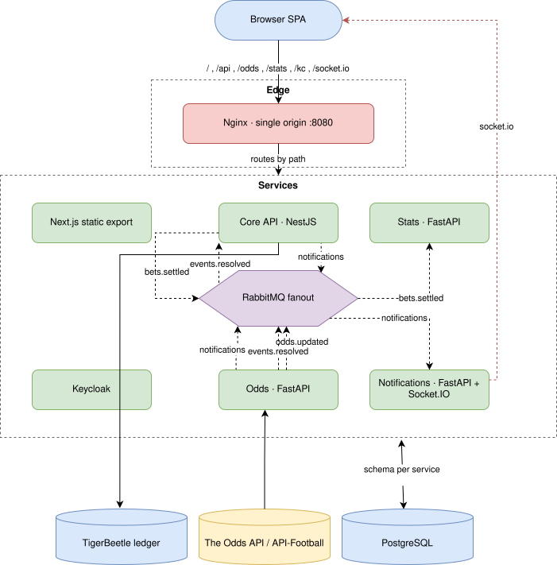

# Architecture

## Overview

This is a distributed sports betting application built for demonstration
purposes. It uses a polyglot service architecture — NestJS for the real-time
core, FastAPI for the odds ingestion service, FastAPI + python-socketio for the
notifications service, and Next.js for the frontend. Services communicate
asynchronously via RabbitMQ fanout exchanges using JSON messages validated
against a shared JSON Schema.

---

## Stack
    
| Layer            | Technology                                          |
|------------------|-----------------------------------------------------|
| Frontend         | Next.js (React, SWR) — static export, OIDC + PKCE   |
| Edge proxy       | Nginx (single origin, path-based routing)           |
| Core API         | NestJS (Node.js) — bets, wallet, settlement         |
| Odds Service     | FastAPI (Python, asyncio) — pluggable providers     |
| Stats Service    | FastAPI (Python) — read model over settled bets     |
| Notifications    | FastAPI + python-socketio (ASGI, uvicorn)           |
| Identity         | Keycloak (OIDC, realm `betting`)                    |
| Messaging        | RabbitMQ (fanout exchanges)                          |
| Message format   | JSON validated against shared JSON Schema            |
| Primary DB       | PostgreSQL (schema-per-service)                      |
| Financial ledger | TigerBeetle (double-entry)                           |
| External data    | The Odds API + API-Football (pluggable providers)   |
| Orchestration    | Docker Compose · Coolify (self-hosted PaaS)         |

---

## Services

### Next.js — Frontend (SPA)
A pure static single-page app (Next.js App Router, `output: "export"`).
`next build` emits `./out/`, which is copied straight into the nginx image —
there is no Node.js frontend runtime and no server-side auth; the browser
runs the bundle and talks to the backend itself.

- **Authentication** — uses the OIDC Authorization Code + PKCE flow
  (`oidc-client-ts`) against Keycloak's public `betting-frontend` client. The
  access + ID tokens are held in JS memory only (never persisted), so a
  reload starts anonymous and re-bootstraps a session in the background.
- **Origin-agnostic, zero runtime config.** The realm (`betting`) and client id
  are the same in every environment and Keycloak is fronted same-origin under
  `/kc`, so the entire OIDC configuration is derived from
  `window.location.origin`. There is no `/config.js` / `window.__ENV` injection
  step — one static export runs unchanged on dev (8080) and e2e (18080).
- **Silent renew via a hidden same-origin iframe** (`prompt=none`,
  `automaticSilentRenew` ~60s before expiry). Keycloak's session cookie makes the
  round-trip invisible, so an expiring token never forces a top-level navigation
  and in-flight UI state survives. A 401 from the API or a socket `connect_error`
  triggers the same silent refresh; if it fails, the app drops to anonymous.
- **Roles** — read client-side from the access token's `realm_access` claim
  and drive UI gating only (e.g. the admin page); they are never trusted for
  authorization, which each service enforces by verifying the JWT itself.
- **Single-origin data access.** Authenticated REST calls hit `/api/*` with the
  access token attached as `Authorization: Bearer …` from the in-memory snapshot;
  public reads (`/odds`, the leaderboard) go unauthenticated. REST responses
  hydrate an SWR cache that live socket.io events merge into (see Inter-service
  Communication).

### Edge proxy (Nginx)
Nginx is the sole browser-facing port and fronts *everything* — the frontend
and the public backend endpoints — so the browser only ever sees one origin.
This eliminates CORS and any need for runtime URL injection in the client
bundle. It still does path-based routing only and is not a smart API
gateway.

Path routing:

| Prefix         | Upstream                          | Notes                     |
|----------------|-----------------------------------|---------------------------|
| `/socket.io/*` | Notifications                     | WebSocket upgrade         |
| `/odds`        | Odds Service                      | Public, unauthenticated   |
| `/stats`       | Stats Service                     | `/me/*` authed, leaderboard public |
| `/api/*`       | Core API                          | Bearer token forwarded    |
| `/kc/*`        | Keycloak                          | OIDC login + token/JWKS   |
| `/` (default)  | Frontend (Next.js)                | Includes HMR WebSocket    |

Responsibilities:
- Path-based routing as above
- WebSocket connection upgrade for the live event feed (`/socket.io/`)
- Serves the SPA's static export at `/` (origin-agnostic: the SPA derives its
  Keycloak issuer from the current origin, so the same image runs on dev/8080
  and e2e/18080 with no per-environment config)
- Reverse-proxies Keycloak under `/kc` so the IdP is same-origin too

Explicitly not responsibilities of the proxy:
- **Authentication / authorisation** — each service verifies its own JWTs.
- **Rate limiting** — handled per-service if at all.

Keycloak sits behind nginx too, under the `/kc` path prefix
(`KC_HTTP_RELATIVE_PATH=/kc`), so the browser only ever sees the single nginx
origin. The login/refresh/logout hops are top-level redirects that need no CORS
regardless, but the SPA's PKCE code→token exchange is a `fetch` — routing
Keycloak through the same origin removes its dependence on the client's
Keycloak `webOrigins` CORS allow-list. Service-to-Keycloak backchannel traffic
(JWKS, admin API) stays
in-cluster via `KEYCLOAK_INTERNAL_URL` (`http://keycloak:8080/kc`) and does not
traverse nginx.

### Keycloak — Identity provider
Keycloak owns all authentication. The realm `betting` defines two roles —
`admin` (gates admin pages) and `user` (default for everyone) — plus two
clients: a public `betting-frontend` (PKCE, used by the SPA) and a
confidential `betting-core` (service-account access to the admin API for
user-info lookups). Keycloak persists to its own `keycloak` database on the
shared Postgres instance, isolated from the app's `betting` database.

### NestJS — Core API
The primary application service. Responsibilities:
- Bet placement and settlement logic. The **server** prices every bet: the
  request carries no odds, and core stamps the line from its own odds cache
  (409 if it hasn't got one for that selection)
- Keeps that cache current off the `odds.updated` fanout, warmed at boot by a
  one-shot `GET /odds/events` against the Odds service — the only HTTP core
  makes to a sibling, and never during a request
- Wallet / ledger operations against TigerBeetle (in-process module)
- Subscribes to the `events.resolved` exchange (durable queue
  `core.events.resolved`) and settles any held bets on the resolved event
- Publishes per-user UI events (bet held / settled, balance updated,
  insufficient balance) to the `notifications` exchange for the notifications
  service to deliver

Internally the wallet logic lives as a Nest module within the core service and
is invoked by the bets module via direct method calls — no broker hop for
money movement.

### FastAPI + python-socketio — Notifications Service
The only service the browser holds an open socket to. Responsibilities:
- Accepts socket.io connections, verifies the JWT on `connect`, and joins each
  socket into a room named after its `sub` claim
- Binds an exclusive auto-delete queue to the `notifications` fanout exchange;
  for each `NotificationEvent` it emits the carried JSON payload to the target
  user's room (or broadcasts if `userId` is empty)

The service is stateless — no DB, no business logic — and exists purely so the
frontend has a fan-out point that doesn't depend on Core staying up to keep
sockets healthy.

### FastAPI — Odds Service
Lightweight async service responsible for ingesting odds from one or more
external providers. Responsibilities:
- Runs a concurrent `asyncio` polling loop (using `aiohttp`) per enabled
  provider (`ODDS_PROVIDERS`); providers run side by side
- Normalises each provider's payload into a provider-agnostic common model
  (`CanonicalEvent` → `Market`s → `Selection`s) that represents many sports and
  bet types; events are kept separate per provider, stamped with an `origin`,
  and linked back to source ids via an `event_source_map` table
- Persists current odds to Postgres (the flexible model as JSONB, plus the
  projected 3-way columns the wire/HTTP contract reads)
- Publishes `OddsUpdatedEvent` messages to the `odds.updated` fanout exchange
- Serves the public `GET /odds/events` HTTP endpoint used by the frontend to
  hydrate the live markets board on first paint (live updates after that
  arrive via the notifications socket)

> Note: This service does not calculate odds. It is purely an ingestion and
> normalisation layer over an external feed.

### FastAPI — Stats Service
Maintains a read model built from settled bets — a logically separate read store
(its own schema) kept in sync off an event, so the dashboard's aggregate reads
don't hit Core.
Responsibilities:
- Subscribes to the durable `bets.settled` exchange (durable queue
  `stats.bets.settled`, manual ack) and upserts one row per settlement into its
  own `stats` schema (`stats_settlements`) of the shared `betting` DB, keyed on
  `betId` so redelivery is idempotent
- Serves the dashboard reads: `GET /stats/me/pnl` (cumulative ROI% per active
  UTC day), `GET /stats/me/summary` (staked / win-rate / ROI / net P&L — both
  authed), and `GET /stats/leaderboard` (top players by ROI, public)

The stats service owns its store and never reads Core's or Odds' tables —
the `BetSettledEvent` carries everything it needs (denormalized, incl. the
player's display name). It starts empty and accrues forward; there is no
backfill.

---

## Service boundaries — why the split needs no distributed transactions

The services are deliberately carved along lines where **no single user action
has to be committed across two services at once.** Every write path completes
inside one service against one datastore; anything another service needs to know
afterwards travels as an asynchronous message. There is no synchronous
cross-service request in a write path, no two-phase commit, and no distributed
transaction to coordinate or roll back — the only in-process coupling is the
wallet living inside Core.

The split follows a few rules:

- **Each service owns its own state and writes only to it.** Core owns bets and
  the ledger, Odds owns the odds tables, Stats owns its read model. No service
  reaches into another's schema — a subscriber that needs data gets it from the
  message payload (e.g. `BetSettledEvent` carries the player's display name so
  Stats never queries Core).
- **Money movement stays inside one transaction boundary.** The wallet is a Nest
  module *inside* Core, invoked by the bets module via direct method calls, so a
  bet and its debit/credit against TigerBeetle happen in-process — never a broker
  hop, an RPC, or a saga that could half-commit.
- **Cross-service coordination is one-way and asynchronous.** A service publishes
  a fact about something it already committed ("event resolved", "bet settled")
  and moves on; it never blocks on a downstream service, and downstream failure
  can't roll the publisher back. Settlement is a good example: Core consumes
  `events.resolved`, then settles held bets purely against its *own* Postgres and
  TigerBeetle — the resolving service (Odds) is not in that path.
- **Consistency is eventual, and that's acceptable here.** Because messages are
  fire-and-forget, downstream state (the notifications a user sees, the Stats
  dashboard) converges slightly after the authoritative write rather than
  atomically with it. Durable queues + idempotent, `betId`-keyed upserts make
  redelivery safe, so eventual convergence is the only guarantee any consumer
  needs.
- **A service may call another *out of band*, never while serving a request.**
  The rule the split protects is that no request fans out across services — not
  that one service may never speak HTTP to another. Warming a local replica at
  startup, or on a background schedule, is outside any request and can't drag a
  second service's latency or availability into a user-facing path: it retries,
  it degrades, and the caller keeps serving. Core's odds cache is the worked
  example (below). What stays banned is the synchronous variant — reading
  another service mid-request, so that its failure becomes yours.

### Worked example: Core's odds cache

Core needs the current line to price a bet, and the line belongs to Odds. It
gets one without ever calling Odds on the placement path:

- `OddsCacheService` subscribes to the `odds.updated` fanout and keeps an
  in-memory map of the current h2h prices. This is the steady-state feed.
- At boot it also `GET`s `/odds/events` once, retrying with backoff, purely to
  avoid an empty cache after a restart. Failure is logged, not fatal — the cache
  simply fills from the next tick instead.
- `POST /bets` reads only that local map. Odds can be down, redeploying, or
  mid-poll and placement is unaffected; the bet is stamped with the cached price
  and settlement later reads it back off the bet row.

The hydrate is the allowed shape: asynchronous relative to any request,
best-effort, and replaceable by the message stream. A version of this that
looked up the price over HTTP inside `place()` would be the banned shape, and is
the reason the cache exists at all.

The one seam this leaves open is the publish itself: a service's local write and
its subsequent publish are two steps, so a crash between them can lose an event.
That's the transactional-outbox gap called out under "Production gaps &
trade-offs" — a conscious trade, not an accident of the split.

---

## Inter-service Communication

Cross-process traffic flows over RabbitMQ fanout exchanges with JSON
payloads — the schemas in `schemas/json/` serve as the contract (`events.json`
for the pubsub messages, `rest.json` for the HTTP resource shapes), from which
each service generates its bindings (Zod for TS, Pydantic for Python). The wallet
logic is colocated inside Core as a Nest module; bets call the wallet via
direct in-process method calls.

The frontend talks to Core and Odds over HTTP and to Notifications over a
socket.io connection — all through the Nginx proxy on a single origin.
Authenticated calls go to `/api/*` (proxied to Core) with the Keycloak
access token attached client-side as `Authorization: Bearer …` from the
SPA's in-memory store. The `/odds/events` hydrate is public and hits the gateway
without auth.

Each exchange is a `fanout` type. Subscribers declare their own anonymous
exclusive auto-delete queue and bind it to the exchange — semantically
equivalent to publish/subscribe: every running subscriber gets a copy, and
messages sent while no subscriber is connected are dropped.

### Exchanges and event types

| Exchange          | Publisher           | Subscribers   | Payload              |
|-------------------|---------------------|---------------|----------------------|
| `odds.updated`    | Odds Service        | —             | `OddsUpdatedEvent`   |
| `events.resolved` | Odds Service        | Core API      | `EventResolvedEvent` |
| `bets.settled`    | Core API            | Stats Service | `BetSettledEvent`    |
| `notifications`   | Core + Odds Service | Notifications | `NotificationEvent`  |

`bets.settled` is durable + persistent (like `events.resolved`): the stats
read model must not drop settlements, so it cannot ride the fire-and-forget
`notifications` exchange.

The browser's live odds updates do not flow over `odds.updated`: the Odds
Service separately broadcasts an `oddsUpdated` `NotificationEvent` (empty
`userId`) on the `notifications` exchange, which the Notifications service
relays. `odds.updated` carries the raw `OddsUpdatedEvent` and currently has no
in-process subscriber. Core consumes `events.resolved` to settle held bets.

`NotificationEvent` is a flat envelope: `userId` (empty = broadcast), `kind`
(discriminator mapped to a socket.io event name), and `payload` (the inner
message object the frontend consumes verbatim). It is fire-and-forget — Core
does not wait for a reply.

### Why JSON Schema?
- One schema is the contract for all four services; bindings are generated, so
  drift is caught by the pre-push guard rather than at runtime
- Runtime validation on both ends (Zod / Pydantic) — malformed messages are
  rejected at the boundary instead of corrupting state
- Human-readable on the wire (RabbitMQ management UI, socket frames), and no
  binary toolchain to install

---

## Data Storage

### PostgreSQL
A single Postgres instance backs the whole stack. It hosts two databases:

- **`betting`** — the application database, partitioned into one schema per
  service (`DB_SCHEMA` selects it) so each owns its tables in isolation:
  - `core` — local user records (id only — PK matches the Keycloak `sub`; email
    and name are fetched on demand from Keycloak), bet history and state.
  - `odds` — current odds + history written by the Odds service (read over HTTP
    by the SPA, not via a shared table).
  - `stats` — the Stats read model (`stats_settlements`), kept independent of
    Core's tables.
- **`keycloak`** — Keycloak's own database (own role/credentials), isolated from
  application data.

`postgres/init.sh` provisions the `keycloak` database and the three schemas on
first boot of a fresh data volume.

### TigerBeetle
Owned exclusively by Core's wallet module. Stores:
- All account balances
- Every debit and credit as an immutable double-entry transfer
- Provides strong consistency and crash-safety guarantees for financial data

### RabbitMQ
Shared infrastructure, used as the inter-service event bus (see
"Inter-service Communication" above). The management UI is exposed on
`localhost:15672` in dev (user `betting`, password `betting_dev`).

---

## External Dependencies

| Dependency                  | Used by      | Purpose                                            |
|-----------------------------|--------------|----------------------------------------------------|
| The Odds API                | Odds Service | Multi-sport odds (h2h, totals) — provider `theoddsapi` |
| API-Football (api-sports.io)| Odds Service | Football fixtures + rich bet types — provider `apifootball` |

---

## Deployment

Each service runs as an independent Docker container.

- **Local** — `docker-compose.yml` wires up all services, Nginx, Keycloak,
  RabbitMQ, PostgreSQL, and TigerBeetle. Variants activate explicitly via named
  overlays (`docker-compose.dev.yml` / `.ci.yml` / `.e2e.yml`) — there is no
  auto-loaded `override` file, and host ports stay unprivileged (Nginx on 8080).
- **Production** — `docker-compose.coolify.yml`, a standalone (not overlaid)
  stack deployed by Coolify onto a self-hosted server. It declares no `build:`
  steps and no host ports: every service pulls its promoted GHCR image, and
  Coolify's Traefik terminates TLS and routes one domain to Nginx:80. Per-deploy
  credentials come from Coolify's generated `SERVICE_PASSWORD_*` variables, and
  a single `PUBLIC_ORIGIN` drives Keycloak's hostname, every service's issuer
  URL, and the realm rendered at boot from `keycloak/realm.template.json`. See
  `docs/DEPLOYMENT.md`.
- **Images** — built and pushed to GHCR by CI only: the PR pipeline runs
  `test → build images → e2e`, and on `main` the e2e-validated `:<sha>` images
  are promoted to `:latest` by digest (a manifest copy, not a rebuild).

---

## Production gaps & trade-offs

BetPossum is a demonstration system, and some corners are cut deliberately.
These are the known gaps and what closing each one would look like:

- **DB schema management** — Core runs TypeORM with `synchronize: true`, which
  auto-syncs entities to tables on boot. Fine for a demo with disposable data;
  production would use versioned migrations so schema changes are reviewed,
  ordered, and reversible.
- **No transactional outbox** — a settlement's Postgres write and its
  `bets.settled` publish are two separate operations, so a crash between them
  can produce a settled bet whose event was never published. The durable
  queues + `betId`-keyed idempotent upserts make *redelivery* safe, but they
  cannot recover a publish that never happened. Production fix: an outbox
  table drained by a relay, or CDC.
- **Secrets** — dev credentials (`betting_dev`, Keycloak admin/admin, the
  `betting-core` client secret) live in plaintext in `docker-compose.yml`, which
  is fine for a stack that only ever listens on localhost. The Coolify stack does
  better: every credential is a generated `SERVICE_PASSWORD_*` value that never
  enters the repo, injected into `postgres/init.sh` and into the realm rendered
  by `keycloak/render-realm.sh`. That is still not a secrets manager — there is
  no rotation, no audit trail, no dynamic credentials, and rotating the
  `betting-core` client secret means recreating the Keycloak database because
  `--import-realm` will not revisit an existing realm.
- **Single points of scale** — the odds poller and the notifications relay
  are single-instance; scaling either takes real design work
  (partitioned/leader-elected polling for the poller; sticky routing or a
  socket.io message-queue adapter for notifications). Postgres, RabbitMQ, and
  TigerBeetle each run as one node — HA would mean a managed Postgres, quorum
  queues, and a TigerBeetle replica cluster.
- **Observability depth** — there is no metrics or log aggregation, and no
  distributed tracing. Next steps are prom-client / prometheus_client
  instrumentation with a Prometheus + Grafana stack, and OpenTelemetry trace
  propagation across the RabbitMQ hops.
- **Edge hardening** — Nginx does path routing only; there is no rate
  limiting, request size policing beyond defaults, or WAF. Acceptable behind a
  demo, not for an internet-facing betting API.
- **Stats rebuilds** — the read model accrues forward from `bets.settled` and
  has no backfill/replay path; rebuilding it after a bug or schema change
  would need an event replay mechanism or a rebuild from Core's bet history.
- **No balance top-up** — a user gets a one-off play-money grant when their
  account is first created (`STARTING_BALANCE_CENTS` in
  `services/core/src/users/users.service.ts`) and has no way to add funds once
  it runs out; the only refill path is an admin setting the balance outright
  via `PUT /api/admin/users/:userId/balance`. A real deposit flow means a
  payment provider, a webhook confirming settled funds, and a ledger transfer
  keyed to the payment so a retried webhook can't double-credit.
