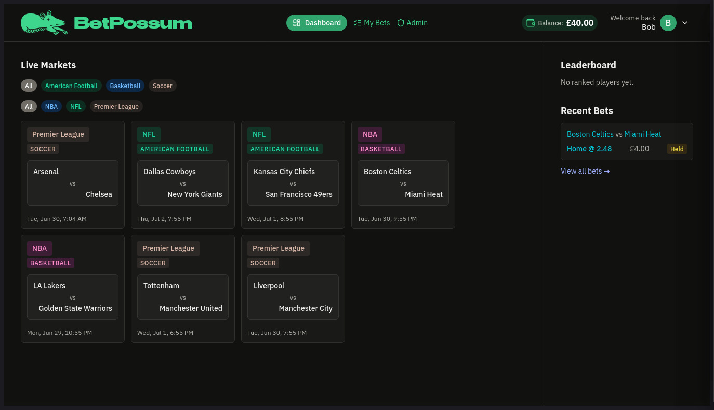
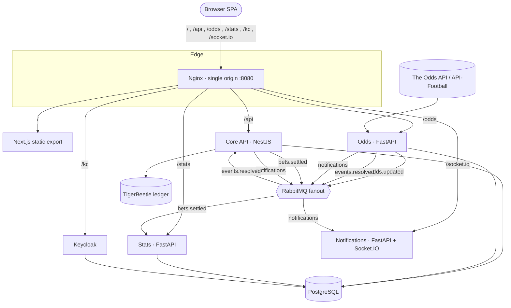

# BetPossum

[](https://github.com/andrasore/betpossum/actions/workflows/pr.yml)

> A distributed, event-driven sports-betting platform — four backend services
> using Node.js and Python, and a Next.js frontend, wired together over a RabbitMQ
> message bus with schema-validated contracts.


## Overview

BetPossum is a demonstration sports-betting application built as a small
polyglot microservice system. A NestJS core handles bets and the wallet, two
FastAPI services ingest odds and serve a stats read model, a FastAPI + Socket.IO
service fans real-time events out to browsers, and a Next.js SPA is served as a
pure static export. Services never call each other's databases — they
communicate asynchronously over RabbitMQ fanout exchanges using JSON messages
validated against a shared JSON Schema, and the whole stack sits behind a single
Nginx origin so the browser never deals with CORS or runtime config injection.

For the full design rationale — settlement semantics, durable channels, the
canonical odds model, observability, and the known
[production gaps & trade-offs](ARCHITECTURE.md#production-gaps--trade-offs) —
see [ARCHITECTURE.md](ARCHITECTURE.md).



## Highlights

### Distributed & polyglot

- Four independent backend services, each owning its own data:
  - **Core** — NestJS (Node.js): bets, wallet, settlement.
  - **Odds** — FastAPI (Python): pluggable odds ingestion.
  - **Stats** — FastAPI (Python): read model over settled bets.
  - **Notifications** — FastAPI + Socket.IO: real-time event fan-out.
- **Pub/sub over RabbitMQ fanout** — each subscriber binds its own queue, so
  services stay decoupled and independently deployable.
- **One JSON Schema contract** — the same schema is the cross-service contract
  for all four services.
- **Generated bindings** — Zod for TypeScript, Pydantic for Python.
- **Drift caught at push time** — a schema guard checks the bindings rather than
  failing at runtime.

### Correctness & data integrity

- **TigerBeetle ledger** — money lives in a double-entry ledger; every
  debit/credit is an immutable transfer with strong consistency, not a mutable
  balance column.
- **Durable, persistent queues** — settlement rides `events.resolved` and
  `bets.settled` with manual ack and idempotent, `betId`-keyed upserts, so a
  redelivery never double-settles or drops a result.
- **Playwright end-to-end tests** — drive the full stack through the browser.
- **Per-service unit tests** — plus a pre-push gate (typecheck, lint, test, e2e,
  schema guard) that protects `main`.

### Auth & security

- **Keycloak OIDC** — uses the Authorization Code + PKCE flow.
- **Self-verified JWTs** — each service verifies tokens on its own.
- **Single Nginx origin** — fronts the SPA, the APIs, and Keycloak, eliminating
  CORS and any per-environment URL injection in the client bundle.

### Infra & DevOps

- **Docker Compose** — dev stack with explicit, named overlays
  (`dev` / `ci` / `e2e`).
- **Kubernetes** — via Kustomize: a shared `base/` with `local` and `prod`
  overlays.
- **GitHub Actions** — CI pipeline: typecheck → build → e2e.
- **Observability (optional)** — kube-prometheus-stack + Loki + Alloy + Grafana
  in its own namespace.

## Architecture



| Exchange          | Publisher           | Subscriber    | Payload              |
|-------------------|---------------------|---------------|----------------------|
| `odds.updated`    | Odds Service        | —             | `OddsUpdatedEvent`   |
| `events.resolved` | Odds Service        | Core API      | `EventResolvedEvent` |
| `bets.settled`    | Core API            | Stats Service | `BetSettledEvent`    |
| `notifications`   | Core + Odds Service | Notifications | `NotificationEvent`  |

## Tech stack

| Layer            | Technology                                          |
|------------------|-----------------------------------------------------|
| Frontend         | Next.js (React, SWR) — static export, OIDC + PKCE   |
| Edge proxy       | Nginx (single origin, path-based routing)           |
| Core API         | NestJS (Node.js) — bets, wallet, settlement         |
| Odds Service     | FastAPI (Python, asyncio) — pluggable providers     |
| Stats Service    | FastAPI (Python) — read model over settled bets     |
| Notifications    | FastAPI + python-socketio (ASGI, uvicorn)           |
| Identity         | Keycloak (OIDC, realm `betting`)                     |
| Messaging        | RabbitMQ (fanout exchanges)                          |
| Message format   | JSON validated against shared JSON Schema            |
| Primary DB       | PostgreSQL (schema-per-service)                      |
| Financial ledger | TigerBeetle (double-entry)                           |
| Orchestration    | Docker Compose · Kubernetes (Kustomize)             |

## Repository layout

```
betpossum/
├── frontend/            # Next.js static-export SPA (OIDC + PKCE, runtime-config-free)
├── nginx/               # Single-origin edge proxy (SPA + APIs + Keycloak)
├── services/
│   ├── core/            # NestJS API: bets, wallet/ledger, settlement
│   ├── odds/            # FastAPI: pluggable odds ingestion + normalisation
│   ├── stats/           # FastAPI: read model over settled bets
│   └── notifications/   # FastAPI + Socket.IO real-time event fan-out
├── schemas/             # Shared JSON Schema contracts → generated Zod/Pydantic
├── keycloak/            # Realm, roles, clients
├── bots/                # Synthetic players that place bets to populate the demo
├── e2e/                 # Playwright full-stack tests
├── k8s/                 # Kustomize base + local/prod overlays + observability
└── docker-compose*.yml  # Local dev stack + named ci/e2e overlays
```

Most folders carry a local `CLAUDE.md` documenting their conventions.

## Getting started

Prerequisites: just Docker + Docker Compose. Everything else (Node, Python,
pnpm) builds inside the images.

```bash
# Build and bring up the whole stack — frontend, the four backend services,
# nginx, keycloak, postgres, rabbitmq, and tigerbeetle.
docker compose up --build
```

Then open http://localhost:8080. The frontend is served as a static export
behind Nginx, so this single command gives you the complete app — no extra
build or config step.

Odds default to a built-in mock provider, so no external API keys are needed,
and the stack starts a small fleet of bots (`BOT_COUNT=10`) that sign up via
Keycloak and place bets, so the live markets, leaderboard, and feed populate on
their own.

| Service                | URL                          |
|------------------------|------------------------------|
| App (via Nginx)        | http://localhost:8080        |
| RabbitMQ management UI  | http://localhost:15672 (`betting` / `betting_dev`) |

To use real odds, set `ODDS_PROVIDERS` (e.g. `theoddsapi`, `apifootball`) and
the matching API keys (`THE_ODDS_API_KEY`, …) before bringing up the stack.

## Development

For iterating on the frontend with hot reload, run it locally instead of baked
into the Nginx image. The `compose:dev` overlay points Nginx at your host's
`pnpm dev` server, so HMR works through the same `:8080` origin.

Prerequisites: Docker + Docker Compose, Node 25, [pnpm](https://pnpm.io) 11
(version is pinned via `packageManager`), Python 3.14.

> This repo is pnpm-only, and build/typecheck/test scripts are meant to be run
> from the repo root (Turbo coordinates the workspaces).

```bash
# 1. Install workspace dependencies
pnpm install

# 2. Bring up the backend stack (core, odds, stats, notifications, nginx,
#    keycloak, postgres, rabbitmq, tigerbeetle) in Docker.
pnpm compose:dev up -d

# 3. Run the frontend locally with hot reload (Nginx proxies it on :8080)
cd frontend && pnpm dev
```

Open http://localhost:8080 for the proxied app, or hit the Vite/Next dev server
directly on http://localhost:3000. Backend services run from built images and do
not hot-reload — rebuild a changed one with
`pnpm compose:dev up -d --build <service>`.

## Common tasks

All run from the repo root:

```bash
pnpm build        # build every service (regenerates schema bindings)
pnpm typecheck    # typecheck all workspaces
pnpm lint         # lint all workspaces
pnpm test         # unit tests across services
pnpm e2e          # Playwright end-to-end suite
pnpm schema:gen   # regenerate Zod/Pydantic bindings from schemas/json
pnpm hooks:setup  # point git at .githooks (enables the pre-push gate)
```

## Testing & CI

- **Unit tests** — one suite per service.
- **Playwright e2e** — [`e2e/`](e2e/) boots the full stack and drives it through
  the browser.
- **Pre-push hook** — runs typecheck, lint, test, e2e, and the schema guard, so
  contract drift and regressions are caught before they reach `main`.
- **GitHub Actions** — ([`.github/workflows/pr.yml`](.github/workflows/pr.yml))
  runs `test → build images → e2e`, then on `main` the e2e-validated `:<sha>`
  images are promoted to `:latest` on GHCR by digest — a manifest copy, not a
  rebuild.

## Deployment

- **Local** — `docker-compose.yml` plus the named `dev` / `ci` / `e2e` overlays
  (activated explicitly with `-f`).
- **Kubernetes** — Kustomize manifests in [`k8s/`](k8s/): a shared `base/` with
  `local` and `prod` overlays, plus an optional observability stack. See
  [`k8s/README.md`](k8s/README.md).
- **Images** — published to GHCR by CI; never pushed manually.

---

> BetPossum is a portfolio / demonstration project. It uses play money only and
> is not a production betting service.
