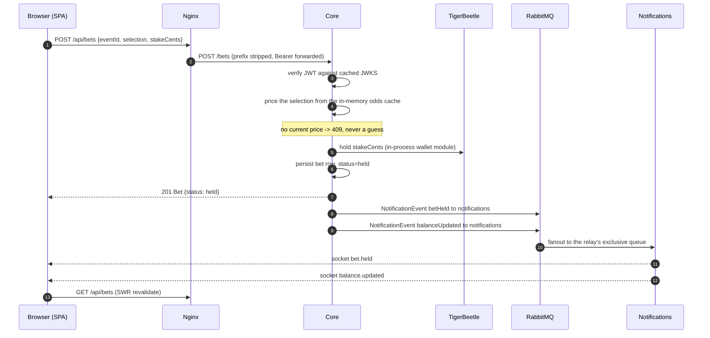
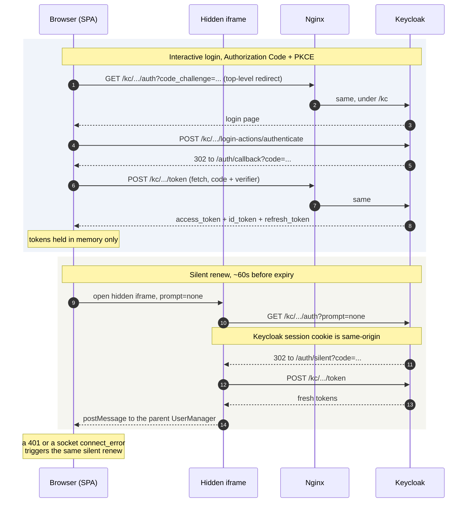
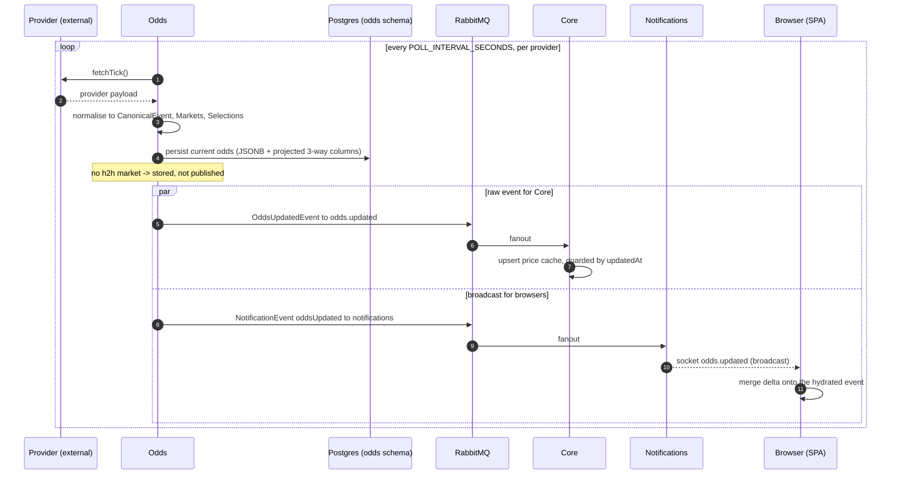
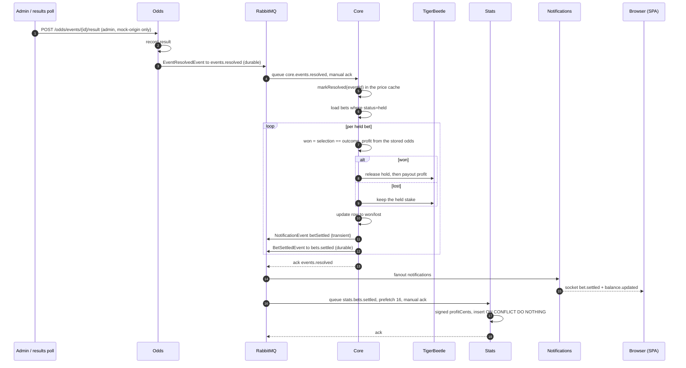

# API & Request Reference

Every request that crosses a process boundary in BetPossum: browser→service,
service→service, service→broker, and service→external provider.

[`ARCHITECTURE.md`](../ARCHITECTURE.md) explains *why* the system is shaped
this way — the service boundaries, why no distributed transactions are needed,
the trade-offs. This document is the *what*: the endpoints, the payloads, the
exchanges, and where each one lives in the source.

- [Ground rules](#ground-rules)
- [Nginx routing](#nginx-routing)
- [Browser → backend HTTP](#browser--backend-http)
- [Browser ↔ Notifications (socket.io)](#browser--notifications-socketio)
- [Browser ↔ Keycloak (OIDC)](#browser--keycloak-oidc)
- [Service → service](#service--service)
- [Service → service, async (RabbitMQ)](#service--service-async-rabbitmq)
- [Outbound to external providers](#outbound-to-external-providers)
- [Non-browser client: `bots/`](#non-browser-client-bots)

---

## Ground rules

Four facts that make everything below make sense.

**1. Single origin.** Nginx is the only port the browser ever sees. It fronts
the SPA, all three HTTP services, the socket, and Keycloak. There is no CORS
anywhere in the system and no runtime URL injection in the client bundle — the
SPA derives everything from `window.location.origin`.

**2. No Nest global prefix.** `setGlobalPrefix` appears in no service. Every
controller path is the literal route. The `/api` prefix you see in the browser
is added by the client and **stripped by nginx** — `/api/bets` arrives at Core
as `/bets`. `/odds` and `/stats` are identity rewrites, so those paths are the
same inside and out. This asymmetry is the single most confusing thing in the
request layer; when a path in this document has an `/api` prefix, the internal
route column tells you what the service actually sees.

**3. Auth is deny-by-default.** Core, Odds and Stats each register
`JwtAuthGuard` as an `APP_GUARD`:

| Service | Registration |
|---|---|
| core | `services/core/src/keycloak/keycloak-auth.module.ts` |
| odds | `services/odds/src/auth/auth.module.ts` |
| stats | `services/stats/src/auth/auth.module.ts` |

So **every route requires a valid Bearer token unless it carries `@Public()`**.
Notifications registers no HTTP guard at all — its only auth is the socket.io
handshake. `RolesGuard` is layered on per-controller or per-route where the
`admin` realm role is additionally required.

**4. Nginx never authenticates.** It forwards `Authorization` untouched. Each
service verifies its own JWT against Keycloak's JWKS. The proxy does path
routing and nothing else — no rate limiting, no token inspection, no gateway
logic.

---

## Nginx routing

`nginx/nginx.conf` (`nginx.dev.conf` is identical except the `/` block, which
proxies to the Next dev server for HMR). The container listens on 80, published
as 8080 in dev and 18080 in e2e.

| location | proxy_pass | Path handling |
|---|---|---|
| `/socket.io/` | `http://notifications:8000` | Preserved. WebSocket upgrade via the `$connection_upgrade` map |
| `/odds` | `http://odds:8000/odds` | Identity |
| `/stats` | `http://stats:8000/stats` | Identity |
| `/api/` | `http://core:4000/` | **`/api` stripped** — `/api/bets` → `/bets` |
| `/kc/admin/` | `return 404` | Longest-prefix match wins over `/kc/`; blocks the admin console and admin REST API from the browser |
| `/kc/` | `http://keycloak:8080/kc/` | Identity. Adds `X-Forwarded-Proto` / `X-Forwarded-Host` |
| `/` | Static export (dev: `http://frontend:3000`) | SPA shell, `try_files … /index.html` |

Four response headers are applied to every response with `always`, so they
cover error responses too:

```
X-Frame-Options: SAMEORIGIN
Content-Security-Policy: frame-ancestors 'self'
X-Content-Type-Options: nosniff
Referrer-Policy: strict-origin-when-cross-origin
```

The CSP is scoped to `frame-ancestors` only — a full script/style policy would
break Next's and Chakra's inline assets. It is `'self'` rather than `'none'`
**because the OIDC silent-renew iframe frames a same-origin page**; tightening
it to `'none'` silently breaks token refresh. That is a real coupling between
the proxy config and the auth flow, and it is easy to "harden" by accident.

The `$forwarded_proto` map exists so that behind a TLS-terminating edge
(Coolify's Traefik) Keycloak — which builds absolute URLs from
`KC_PROXY_HEADERS=xforwarded` — hands the browser `https://` endpoints even
though this listener itself speaks plain HTTP.

---

## Browser → backend HTTP

### Shared client plumbing

All of it lives in `frontend/src/lib/api.ts`:

- `send()` attaches `Content-Type: application/json` and
  `Authorization: Bearer <token>`. On a **401** it fires `refresh()` (silent
  renew) and throws `Unauthenticated`.
- `authedFetch()` reads the in-memory token via `getAccessToken()`; if there
  isn't one it triggers `refresh()` and throws without making a request.
- `api(path)` is `authedFetch("/api" + path)`.
- Public reads use a **bare `fetch`** with no `Authorization` header at all.

Worth noting: `/stats/me/*` and `/odds/events/:id/result` are authenticated but
call `authedFetch` **directly** rather than through the `api()` helper, because
they are not Core routes and so must not get the `/api` prefix.

### Core — `/api/*`

Every Core route requires a Bearer token; there is no `@Public()` anywhere in
the service.

| Method + public path | Internal route | Auth | Controller |
|---|---|---|---|
| `POST /api/bets` | `POST /bets` | Bearer | `services/core/src/bets/bets.controller.ts` |
| `GET /api/bets` | `GET /bets` | Bearer | `bets.controller.ts` |
| `GET /api/wallet/balance` | `GET /wallet/balance` | Bearer | `services/core/src/wallet/wallet.controller.ts` |
| `GET /api/admin/users` | `GET /admin/users` | Bearer + `admin` | `services/core/src/admin/admin.controller.ts` |
| `PUT /api/admin/users/:userId/balance` | `PUT /admin/users/:userId/balance` | Bearer + `admin` | `admin.controller.ts` |

#### `POST /api/bets`

The system's central write. Called from `frontend/src/lib/api.ts` (`placeBet`),
issued by `frontend/src/components/BetSlip.tsx`.

```jsonc
// Request
{
  "eventId":    "string",
  "selection":  "home" | "away" | "draw",
  "stakeCents": 1500          // integer, 1 .. MAX_STAKE_CENTS
}
```

```jsonc
// 201 — the Bet row
{
  "id":          "uuid",
  "userId":      "uuid",
  "eventId":     "string",
  "selection":   "home",
  "odds":        2.5,          // decimal(10,4); see the note below
  "stakeCents":  1500,
  "payoutCents": null,         // profit only, not total return
  "status":      "held",
  "placedAt":    "2026-09-01T12:00:00.000Z"
}
```

| Status | Meaning |
|---|---|
| 400 | Validation failure (non-integer stake, stake < 1 or > `MAX_STAKE_CENTS`, bad `selection`) |
| 401 | Missing or invalid token |
| 409 | Core holds no current price for that selection — unknown event, resolved event, stale cache, or no h2h market |

**The request carries no odds, by design.** `PlaceBetDto`
(`services/core/src/bets/dto/place-bet.dto.ts`) has no `odds` field: the price
is the server's to decide, so a client-supplied one would be either ignored or
an attack surface. Core stamps the line from its own in-memory
`OddsCacheService` and rejects the placement if it hasn't got one — a price it
can't vouch for is a 409, never a guess. Settlement later reads the stamped
odds back off the row, so a bet is always paid at the price it was accepted at.

Because the global `ValidationPipe` runs with `whitelist: true` and *without*
`forbidNonWhitelisted`, a client that still sends `odds` has the field silently
stripped rather than rejected — an older frontend degrades instead of breaking.
`bots/` relies on exactly this.

> **Wire detail:** `Bet.odds` is a `decimal(10,4)` column
> (`services/core/src/bets/bet.entity.ts`). Postgres returns `numeric` as a
> string, which is why Core coerces with `Number(bet.odds)` at every read site.
> Consumers should coerce rather than assume a JSON number.

#### `GET /api/bets`

Returns `Bet[]` for the calling user, ordered `placedAt DESC`. Consumed via SWR
key `"bets"` (`frontend/src/hooks/useBets.ts`), revalidated on the `bet.held`,
`bet.settled` and `connect` socket events.

#### `GET /api/wallet/balance`

```jsonc
{ "balanceCents": 250000 }   // integer cents
```

The hook unwraps it to a bare number (SWR key `"balance"`,
`frontend/src/hooks/useBalance.ts`) and the `balance.updated` socket event
writes straight into that cache with `revalidate: false`.

#### `GET /api/admin/users`

Bearer + the `admin` realm role (`RolesGuard` is class-level on
`AdminController`, so it covers both admin routes).

```jsonc
[
  { "id": "uuid", "email": "a@b.c", "name": "Ada", "betCount": 12, "balanceCents": 250000 }
]
```

Polled every 15s by the admin page.

#### `PUT /api/admin/users/:userId/balance`

`userId` goes through `ParseUUIDPipe` (400 on a malformed id).

```jsonc
// Request                     // Response
{ "amountCents": 500000 }      { "status": "ok" }
```

Sets the balance outright — this is the only way to add funds to an account
after the one-off starting grant.

### Odds — `/odds*`

Route order is load-bearing: `sports` and `leagues` are declared **before**
`:eventId`, or they get swallowed as event lookups and 404. Two specs guard
this (`services/odds/src/odds/odds.controller.ts`).

| Method + path | Auth | Query | Response |
|---|---|---|---|
| `GET /odds/sports` | `@Public()` | — | `Sport[]` |
| `GET /odds/leagues` | `@Public()` | `?sport=<slug>` | `League[]` |
| `GET /odds/events` | `@Public()` | `?sport=<slug>`, `?league=<int>` | `OddsEvent[]` |
| `GET /odds/events/:eventId` | `@Public()` | — | `OddsEvent`, or 404 |
| `POST /odds/events/:eventId/result` | Bearer + `admin` | — | `{ eventId, outcome, resolvedAt }` |

`?league` is coerced by `ParseIntPipe({ optional: true })` — a query param
arrives as a string and class-validator won't coerce it, while `optional` keeps
an absent one as `undefined` rather than a 400.

`GET /odds/events/:eventId` exists and is public but **no client calls it**.

The resource shapes are contracts in `schemas/json/rest.json`:

```jsonc
// Sport                       // League
{ "slug": "soccer_epl",        { "id": 39,
  "name": "Premier League" }     "name": "Premier League",
                                 "sportSlug": "soccer_epl" }
```

```jsonc
// OddsEvent — the hydrate the live odds delta is merged onto
{
  "eventId":      "string",
  "origin":       "mock",        // provider that produced it
  "sport":        "soccer_epl",
  "homeTeam":     "string",      // raw provider name
  "awayTeam":     "string",
  "homeOdds":     2.5,           // decimal; 0 when no h2h market
  "awayOdds":     2.9,
  "drawOdds":     3.1,           // 0 when no draw market (e.g. basketball)
  "updatedAt":    1756713600000, // Unix ms

  // optional / nullable
  "commenceTime": 1756800000000, // kickoff; hydrate-only, never on a tick
  "outcome":      null,          // "home"|"away"|"draw" once resolved
  "resolvedAt":   null,
  "sportName":    "Football",    // canonical names from the entity join;
  "leagueId":     39,            // null when the link is unresolved and
  "leagueName":   "Premier League",
  "homeTeamName": "Arsenal",     // the UI falls back to the raw fields
  "awayTeamName": "Chelsea"
}
```

`homeOdds` / `awayOdds` / `drawOdds` are the **projected 3-way columns**. Odds
stores a richer canonical model as JSONB internally; the HTTP and wire
contracts only expose the h2h projection.

#### `POST /odds/events/:eventId/result`

Admin action, `@HttpCode(201)`. Body `{ "outcome": "home" | "away" | "draw" }`.

| Status | Meaning |
|---|---|
| 201 | Recorded, and an `EventResolvedEvent` published to `events.resolved` |
| 404 | Unknown event |
| 409 | The event's `origin` is not `mock` |

Manual resolution is deliberately restricted to mock-origin events, so we never
have to reconcile a real provider's own settlement against ours. This is the
entry point of the settlement flow — see
[diagram 4](#4-settlement-and-the-stats-read-model).

### Stats — `/stats*`

| Method + path | Auth | Response |
|---|---|---|
| `GET /stats/me/pnl` | Bearer | `PnlPoint[]` |
| `GET /stats/me/summary` | Bearer | `Summary` |
| `GET /stats/leaderboard` | `@Public()` | `LeaderboardEntry[]` |

Keyed on the JWT `sub` (`services/stats/src/stats/stats.controller.ts`).

```jsonc
// PnlPoint[] — cumulative ROI%, one point per active UTC day
[ { "date": "2026-09-01", "roiPct": 12.5 } ]

// Summary
{ "totalStakedCents": 100000, "settledCount": 42, "wins": 20,
  "winRatePct": 47.6, "netProfitCents": 12500, "roiPct": 12.5 }

// LeaderboardEntry[] — ROI desc
[ { "userId": "uuid", "userName": "Ada", "roiPct": 12.5,
    "netProfitCents": 12500, "settledCount": 42 } ]
```

The leaderboard is bounded by `LEADERBOARD_LIMIT` (default 7) and
`LEADERBOARD_MIN_SETTLED` (default 3), both read **once in the constructor**,
not per request.

All three hooks (`frontend/src/hooks/useStats.ts`) revalidate on the
`bet.settled` and `connect` socket events.

### Health

| Service | Endpoint | Response |
|---|---|---|
| odds | `GET /health` | `{ status, providers: string[], storage: string }` |
| stats | `GET /health` | `{ status: "ok" }` |
| notifications | `GET /health` | `{ status: "ok" }` (unauthenticated — the service has no HTTP guard) |
| core | **none** | — |

Core exposing no HTTP health route is an asymmetry, not an omission in this
table: its container probe is a raw TCP connect to 4000, with an explicit
comment saying why in `docker-compose.coolify.yml`. A liveness check that can't
distinguish "listening" from "DB or broker broken" is weaker than the other
three, which is worth knowing when reading a green healthcheck.

### Auth summary

| | Endpoints |
|---|---|
| **Public** | `GET /odds/sports`, `GET /odds/leagues`, `GET /odds/events`, `GET /odds/events/:id`, `GET /stats/leaderboard`, all `/health`, all static assets |
| **Bearer** | `POST /api/bets`, `GET /api/bets`, `GET /api/wallet/balance`, `GET /stats/me/pnl`, `GET /stats/me/summary` |
| **Bearer + `admin` realm role** | `GET /api/admin/users`, `PUT /api/admin/users/:id/balance`, `POST /odds/events/:id/result` |

The SPA also redirects away from `/admin` unless the decoded access token
carries the `admin` role — that is **cosmetic UI gating only**. Roles are read
client-side from the `realm_access` claim without signature verification and
are never trusted for authorization; each service verifies the JWT and enforces
the role itself.

### Flow: placing a bet



The wallet is a Nest module **inside** Core, invoked by the bets module through
direct method calls — the hold and the bet row commit in one process, with no
broker hop and no distributed transaction. Note also that the HTTP response
returns before the notifications are published: the socket events are how the
*other* tabs and the balance widget converge, not how the placement completes.

---

## Browser ↔ Notifications (socket.io)

`frontend/src/lib/websocket.ts` calls `io()` with **no URL**, so the client
connects to `window.location.origin` on the default namespace (`/`) and the
default path (`/socket.io/`). Nginx routes that path to `notifications:8000`
with the upgrade headers. `transports: ["websocket"]` only — there is no HTTP
long-poll fallback, so the browser opens
`GET /socket.io/?EIO=4&transport=websocket` with `Upgrade: websocket`
immediately.

**Handshake auth is a function, not a value:**

```ts
auth: (cb) => cb({ token: getAccessToken() ?? "" })
```

socket.io re-evaluates it on every (re)connect, so a token replaced by a silent
refresh in the meantime is picked up automatically. The token rides in the
socket.io CONNECT packet — not a query param, not a header.

Server side (`services/notifications/src/relay/relay.gateway.ts`): a
`server.use(...)` middleware verifies the JWT and calls `next(new Error(...))`
on failure. That is deliberate — passing an `Error` to `next()` makes the
client emit **`connect_error`**, which is what the SPA keys its silent refresh
off. A server-side `disconnect()` would fire `disconnect` instead and silently
break refresh. On success the socket joins a room named after the JWT `sub`,
the same claim Core uses as the user id, so a `NotificationEvent.userId` routes
straight to the right sockets.

`cors: { origin: "*" }` on the gateway is Engine.IO's Origin allowlist, needed
because the proxied upstream Host never matches the browser Origin. The JWT is
the actual boundary.

### Server → client events

| Event | Payload | Routing | Consumer |
|---|---|---|---|
| `odds.updated` | `OddsUpdatedEvent` | **broadcast** | `frontend/src/hooks/useOdds.ts` |
| `bet.held` | `BetHeldNotification` | per-user room | `frontend/src/hooks/useBets.ts` |
| `bet.settled` | `BetSettledNotification` | per-user room | `useBets.ts` and `frontend/src/hooks/useStats.ts` |
| `balance.updated` | `BalanceUpdatedNotification` | per-user room | `frontend/src/hooks/useBalance.ts` |

Names come from `SOCKET_EVENT` in
`services/notifications/src/relay/socket-events.ts`, which maps
`NotificationEvent.kind` → socket event name. Payload shapes are in
[the message contracts](#message-contracts) below; the client validates each
one with the matching generated Zod schema.

`odds.updated` is a **delta**, merged onto the already-hydrated event in the
SWR cache with `revalidate: false`, and dropped if the event hasn't been
hydrated yet. `balance.updated` likewise writes straight into the cache. The
two bet events only trigger a revalidate.

Two lifecycle events the app keys off:

- **`connect`** → revalidate bets, pnl, summary and leaderboard. This is what
  covers settlements that landed while the socket was down; the `notifications`
  exchange is fire-and-forget, so anything published during a disconnect is
  simply gone.
- **`connect_error`** → if `socket.active` (a transport blip, socket.io is
  already retrying) do nothing; otherwise assume a bad or expired token and
  call `refresh()`.

**The client emits nothing.** After the handshake, traffic is one-way
server→client. There is no `socket.emit(...)` anywhere in `frontend/`.

---

## Browser ↔ Keycloak (OIDC)

Config is built in `frontend/src/lib/auth.ts`, entirely from
`window.location.origin` — there is no `/config.js` or `window.__ENV` injection
step, so one static export runs unchanged on dev (8080), e2e (18080) and
production.

| Setting | Value |
|---|---|
| `authority` | `${origin}/kc/realms/betting` |
| `client_id` | `betting-frontend` (public client, PKCE S256) |
| `redirect_uri` | `${origin}/auth/callback` |
| `silent_redirect_uri` | `${origin}/auth/silent` |
| `post_logout_redirect_uri` | `${origin}/login` |
| `response_type` / `scope` | `code` / `openid profile email` |
| `automaticSilentRenew` | `true` |
| `loadUserInfo` | `false` |

Tokens live in `InMemoryWebStorage` — **never persisted to disk**, so a reload
starts anonymous and re-bootstraps in the background. The transient PKCE
verifier and state go in `sessionStorage`, which is also shared with the
same-origin silent-renew iframe. A `localStorage` flag (`auth:previously-authed`)
is the only thing that survives a reload, and it exists purely to decide
whether to attempt a silent bootstrap.

| # | Request | Path | Trigger |
|---|---|---|---|
| 1 | Discovery | `GET /kc/realms/betting/.well-known/openid-configuration` | Lazily, on the first signin call |
| 2 | JWKS | `GET /kc/realms/betting/protocol/openid-connect/certs` | id_token signature validation |
| 3 | Authorize (top-level redirect) | `GET /kc/realms/betting/protocol/openid-connect/auth?response_type=code&client_id=betting-frontend&redirect_uri=…&scope=openid+profile+email&state=…&code_challenge=…&code_challenge_method=S256` | `login()` — `state` carries `returnTo` |
| 4 | Login form | `POST /kc/realms/betting/login-actions/authenticate?…` | Keycloak's own page; sets the session cookie |
| 5 | **Code→token** (`fetch`) | `POST /kc/realms/betting/protocol/openid-connect/token` | `handleCallback()` on `/auth/callback` |
| 6 | Silent renew | hidden iframe → `GET …/auth?…&prompt=none&redirect_uri=${origin}/auth/silent`, then a `POST …/token` from inside the iframe | `automaticSilentRenew` ~60s before expiry; also `refresh()` |
| 7 | Logout | `GET /kc/realms/betting/protocol/openid-connect/logout?id_token_hint=…&post_logout_redirect_uri=…` | `logout()` |

**Step 5 is why Keycloak must be same-origin.** The login and logout hops are
top-level redirects that need no CORS regardless, but the PKCE code→token
exchange is a `fetch`. Routing Keycloak under `/kc` removes any dependence on
the client's Keycloak `webOrigins` allow-list.

`refresh()` (step 6) is called from three places besides the expiry timer: a
**401** from any API call, a socket **`connect_error`**, and app bootstrap when
`hasPreviousAuth()`. It is guarded against concurrency by a `refreshing` flag,
and on failure it clears the flag and drops to anonymous rather than looping.

What is deliberately **not** used, which is hard to confirm from code alone:

- **userinfo** — `loadUserInfo: false`. Roles are read by decoding the access
  token's `realm_access` claim locally, for UI gating only.
- **check-session iframe** — `monitorSession` defaults to false in
  oidc-client-ts v3.
- **token revocation on signout** — `revokeTokensOnSignout` defaults to false.

`/auth/callback` and `/auth/silent` are **SPA routes served by nginx's `/`
block**, not Keycloak paths. The AuthProvider suppresses its bootstrap on both
so a renew iframe can't nest another one.

`/kc/admin/*` returns a hard 404 from nginx. Core reaches the Keycloak admin
API backchannel via `KEYCLOAK_INTERNAL_URL`, bypassing nginx entirely, so only
browser access is cut.

### Flow: login and silent renew



The iframe path is what keeps an expiring token from ever forcing a top-level
navigation, so in-flight UI state survives a refresh. It depends on the
`frame-ancestors 'self'` CSP noted [above](#nginx-routing).

---

## Service → service

**Exactly one service→service HTTP call exists in the whole system.** Every
other cross-service interaction is an asynchronous message. This is a design
rule, not an accident: no user-facing request is allowed to fan out across
services, so no request path can inherit a second service's latency or
availability.

### Core → Odds — the boot hydrate

```
GET ${ODDS_SERVICE_URL}/odds/events
```

`services/core/src/odds/odds-cache.service.ts`.

| | |
|---|---|
| **When** | Boot only, from `onModuleInit`, **un-awaited** |
| **Retries** | 12 attempts, linear backoff (`2s × attempt`, capped at 30s), 5s per-request timeout |
| **Auth** | None — works only because the target is `@Public()` |
| **On failure** | Logged, non-fatal |

Core needs the current line to price a bet, and the line belongs to Odds. It
gets one without ever calling Odds on the placement path: `OddsCacheService`
subscribes to the `odds.updated` fanout and keeps an in-memory map, and this
one-shot `GET` merely warms that map after a restart so the cache isn't empty.

Three details that make it the *allowed* shape rather than the banned one:

- It is deliberately **not awaited** — blocking boot on it would make Core's
  readiness hostage to Odds, which is the coupling the module exists to avoid.
- It **stops early** if ticks have already filled the cache while it retried.
- Failure means placements are rejected with 409 until the first tick arrives —
  fail-closed, which is the behaviour we want anyway.

`ARCHITECTURE.md` works through why this is sound in
[the odds-cache example](../ARCHITECTURE.md#worked-example-cores-odds-cache).
A version that looked the price up over HTTP inside `place()` would be the
banned shape, and is the reason the cache exists.

Note the coupling: if `GET /odds/events` ever gains a guard, this hydrate fails
silently — it only logs a warning.

### All services → Keycloak (JWKS)

All four services fetch JWKS from
`${KEYCLOAK_INTERNAL_URL}/realms/${KEYCLOAK_REALM}/protocol/openid-connect/certs`,
lazily on first token verification, then cached and rate-limited by `jwks-rsa`.

| Service | Where |
|---|---|
| core | `services/core/src/keycloak/jwt.strategy.ts` (URLs built in `keycloak.service.ts`) |
| odds | `services/odds/src/auth/jwt.strategy.ts` |
| stats | `services/stats/src/auth/jwt.strategy.ts` |
| notifications | `services/notifications/src/auth/token-verifier.service.ts` |

The first three use `passportJwtSecret`; notifications uses a raw `JwksClient`
plus `jsonwebtoken.verify`, because its verification happens in socket
middleware rather than a Nest guard.

**The two-URL split is deliberate.** JWKS is fetched over the *internal* URL
(in-cluster, bypassing nginx), while the `iss` claim is validated against the
*browser-facing* `KEYCLOAK_ISSUER_URL` — because that is the issuer Keycloak
stamped into the token it gave the browser. Setting both to the same value
breaks one side or the other.

### Core → Keycloak Admin REST

`services/core/src/keycloak/keycloak.service.ts` holds a client-credentials
flow (`POST …/token` with `client_id=betting-core`, cached in memory with a 5s
expiry skew) and an `adminFetch` helper against
`${KEYCLOAK_INTERNAL_URL}/admin/realms/${realm}`, exposing `GET /users/{id}`
and `GET /users?email=…&exact=true`.

**This path is currently wired but never called.** `findUserById` and
`findUserByEmail` have no callers anywhere in `services/core/src`; only
`issuerUrl` and `jwksUri` are consumed. It is documented here rather than
omitted because the service carries `KEYCLOAK_ADMIN_CLIENT_SECRET` purely for
these two methods — anyone auditing that credential needs to be able to find
this. Either wire it up or drop the credential.

### Environment variables carrying these URLs

Defined in `docker-compose.yml`, overridden per-overlay for e2e and by
`PUBLIC_ORIGIN` in `docker-compose.coolify.yml`.

| Variable | Consumed by | Dev value |
|---|---|---|
| `ODDS_SERVICE_URL` | core | `http://odds:8000` |
| `ODDS_MAX_AGE_MS` | core | `21600000` (6h) — must exceed the odds poll interval, or a merely un-refreshed price reads as stale and blocks betting |
| `KEYCLOAK_INTERNAL_URL` | all four | `http://keycloak:8080/kc` |
| `KEYCLOAK_ISSUER_URL` | all four | `http://localhost:8080/kc/realms/betting` (e2e: `:18080`; prod: `${PUBLIC_ORIGIN}/kc/realms/betting`) |
| `KEYCLOAK_REALM` | all four | `betting` |
| `KEYCLOAK_ADMIN_CLIENT_ID` / `_SECRET` | core | `betting-core` / `betting-core-secret` (prod: a generated `SERVICE_PASSWORD_*`) |
| `RABBITMQ_URL` | all four | the shared broker |
| `PORT` | all | core `4000`; odds, stats, notifications default `8000` |
| `BOT_BASE_URL` | bots | `http://nginx` |

---

## Service → service, async (RabbitMQ)

Everything between services that isn't the one hydrate above is a message.

**Every exchange is a `fanout` published with routing key `""`.** There are no
topic, direct or headers exchanges anywhere in the repo, and no DLX, no TTLs,
no publisher confirms, no `mandatory` flag.

### Exchanges

| Exchange | Durable | Publisher(s) | Consumer | Queue | Ack |
|---|---|---|---|---|---|
| `odds.updated` | no | Odds | Core (`OddsCacheService`) | anonymous, exclusive, auto-delete | auto (`noAck`) |
| `notifications` | no | Core + Odds | Notifications (`RelayService`) | anonymous, exclusive, auto-delete | auto (`noAck`) |
| `events.resolved` | **yes** | Odds | Core (`BetsService`) | **`core.events.resolved`**, durable | **manual**, nack-requeue |
| `bets.settled` | **yes** | Core | Stats (`SettlementsConsumer`) | **`stats.bets.settled`**, durable, prefetch 16 | **manual**, nack-requeue |

The durability split is what makes settlement correct. A dropped odds tick is
replaced by the next one, and a missed UI notification is recovered by the
`connect` revalidate — so both of those exchanges are transient and cheap. A
lost *resolution* would leave bets held forever, and a lost *settlement* would
silently corrupt the stats read model, so both of those are durable +
persistent with manual ack and idempotent handlers.

Durability is a per-call option, not per-exchange config
(`opts.durable ?? false`). Only two call sites pass `{ durable: true }`. The
same flag drives four things at once: exchange durability, message
persistence, queue durability, and whether the subscriber gets manual-ack
semantics — and `subscribe()` throws if a durable subscriber doesn't supply a
`queueName`, since an anonymous queue could never survive a restart anyway.

> **There is no central topology file.** Every exchange is asserted lazily by
> *both* sides, inside `publish()` and `consume()`. That means the durability
> flags must match across services or the channel dies with
> `PRECONDITION_FAILED` — declaring `events.resolved` as transient in one
> service is enough to break it everywhere. `OddsPublisher` carries a comment
> to this effect; treat the table above as the authority.

### Publishers

| Service | Exchange | Message | Trigger |
|---|---|---|---|
| odds | `odds.updated` | `OddsUpdatedEvent` | Every canonical event yielded by a provider tick |
| odds | `notifications` | `NotificationEvent` (`oddsUpdated`, broadcast) | The same tick — see below |
| odds | `events.resolved` | `EventResolvedEvent` | Results poll, or the admin resolve endpoint |
| core | `notifications` | `NotificationEvent` (`betHeld`) | Bet placed and the wallet hold succeeded |
| core | `notifications` | `NotificationEvent` (`betSettled`) | Bet settled, win or loss |
| core | `notifications` | `NotificationEvent` (`balanceUpdated`) | **Every** wallet mutation — deposit, admin set, hold, release, keep, payout |
| core | `bets.settled` | `BetSettledEvent` | Once per bet transitioned held → won/lost |

Every publish validates against the generated Zod schema before hitting the
wire.

**The browser's odds updates do not ride `odds.updated`.** Each tick is
published **twice** by `services/odds/src/publisher/odds.publisher.ts`: once
raw to `odds.updated`, which Core's price cache consumes, and once wrapped in a
broadcast `NotificationEvent` on `notifications`, which the relay delivers to
browsers. Events with no h2h market are persisted but not published at all.

### Consumers

- **Core ← `odds.updated`** (`services/core/src/odds/odds-cache.service.ts`) —
  parses each tick and upserts an in-memory `Map<eventId, Entry>`, guarded by a
  monotonic `updatedAt` check and a terminal `resolved` flag so a late tick
  can't reopen a concluded event. A malformed message is logged and dropped.
  This map is what prices every bet placement.
- **Core ← `events.resolved`** (`services/core/src/bets/bets.service.ts`) —
  marks the event resolved in the cache, loads all bets with
  `{eventId, status: 'held'}`, and for each computes `won = selection ===
  outcome` and the profit from the **stored** odds, then settles. Idempotent
  via the `status: 'held'` filter: a settled bet moves to won/lost and is never
  picked up again, so redelivery after a mid-batch crash resumes from the
  remaining held bets.
- **Stats ← `bets.settled`** (`services/stats/src/stats/settlements.consumer.ts`)
  — computes a signed `profitCents` (+payout on a win, −stake on a loss) and
  inserts one `stats_settlements` row with `ON CONFLICT (bet_id) DO NOTHING`,
  so a redelivery is a no-op. A parse failure throws, which nacks and requeues.
- **Notifications ← `notifications`**
  (`services/notifications/src/relay/relay.service.ts`) — see
  [the relay chain](#the-relay-chain). Errors are caught and logged so one bad
  message can't kill the subscription.

> Odds, stats and notifications share an identical messaging wrapper with
> exponential-backoff reconnect and subscription replay. **Core's does not** —
> it has no reconnect logic and throws on boot if the broker is unreachable.
> That asymmetry matters most for Core's durable `core.events.resolved`
> consumer.

### Message contracts

Source of truth: `schemas/json/events.json`. Every service and the frontend
generate Zod bindings from it — see [`schemas/CLAUDE.md`](../schemas/CLAUDE.md)
for the codegen and drift-guard workflow. All keys are camelCase; all amounts
are integer cents; all timestamps are Unix ms.

| `$def` | Carried on | Fields |
|---|---|---|
| `OddsUpdatedEvent` | `odds.updated`, and as the `payload` of an `oddsUpdated` notification | `eventId`, `homeOdds`, `awayOdds`, `drawOdds` (0 = no draw market), `updatedAt` |
| `EventResolvedEvent` | `events.resolved` | `eventId`, `sport`, `outcome` (`home`/`away`/`draw`), `resolvedAt` |
| `BetSettledEvent` | `bets.settled` | `userId`, `userName` (nullable), `betId`, `eventId`, `selection`, `odds`, `stakeCents`, `won`, `payoutCents`, `settledAt` |
| `BetHeldNotification` | `notifications` → socket `bet.held` | `betId` |
| `BetSettledNotification` | `notifications` → socket `bet.settled` | `betId`, `won`, `payoutCents` |
| `BalanceUpdatedNotification` | `notifications` → socket `balance.updated` | `balanceCents` |
| `NotificationEvent` | the `notifications` envelope | `userId` (empty = broadcast), `kind`, `payload` |

Two things that are easy to get wrong:

**`BetSettledEvent` ≠ `BetSettledNotification`.** The first is the durable
event-sourcing contract for the stats read model: denormalized, carrying
everything the read side needs including the player's display name, so Stats
never reaches into Core's tables. The second is a transient UI notification
with three fields. They are different messages on different exchanges with
different delivery guarantees, and only their names are similar.

**`payoutCents` is profit only, never total return.** It is 0 on a loss. This
holds consistently across `Bet.payoutCents`, `BetSettledEvent` and
`BetSettledNotification`.

`NotificationEvent.payload` is typed as a plain object with
`additionalProperties: true` — the envelope is validated, but the inner payload
is **not** discriminated-union-validated against `kind` at the relay. The
frontend re-validates it with the matching schema on arrival.

`OddsUpdatedEvent` is a delta by design. Static identity — sport, teams,
origin, canonical display names, kickoff — rides the `GET /odds/events`
hydrate, never a tick.

### The relay chain

1. A publisher builds `NotificationEvent { userId, kind, payload }` and
   publishes it to the transient `notifications` fanout.
2. `RelayService` consumes it on an anonymous exclusive auto-delete queue with
   `noAck`.
3. It re-validates the envelope, looks up `SOCKET_EVENT[kind]`, and emits the
   **inner `payload` verbatim** — no re-wrapping, so what the browser receives
   is exactly the inner message object.
4. `userId` is the Keycloak `sub`, which is the room each socket joined at
   connect. An empty `userId` becomes `server.emit(...)` — a broadcast to every
   connected socket, which is how `odds.updated` reaches everyone.

Adding a notification type means: a message `$def` plus a `kind` enum value in
`schemas/json/events.json`, then an entry in `SOCKET_EVENT`, then the publisher
call in Core.

### Flow: an odds tick reaching the browser



The double publish is the part worth remembering: one copy prices bets, the
other paints the board, and they travel on exchanges with different durability.

### Flow: settlement and the stats read model



This is the only flow that touches all four services and both durability
classes. Two independent idempotency mechanisms carry it: Core's
`status: 'held'` filter, and Stats' `betId`-keyed conflict clause. Neither
depends on the broker delivering exactly once — both make redelivery a no-op.

The seam this leaves open is the publish itself: Core's Postgres write and its
`bets.settled` publish are two separate steps, so a crash between them can
settle a bet whose event was never published. Durable queues make *redelivery*
safe but cannot recover a publish that never happened. That is the
transactional-outbox gap recorded under
[production gaps](../ARCHITECTURE.md#production-gaps--trade-offs).

---

## Outbound to external providers

Providers are selected by `ODDS_PROVIDERS` (comma-separated, default `mock`).
Each enabled provider runs its **own concurrent poll loop**
(`services/odds/src/runner/runner.service.ts`), started from
`onApplicationBootstrap`.

`POLL_INTERVAL_SECONDS` is a **sleep after** each tick, not a fixed rate, so
ticks can never overlap. Each tick does `fetchTick()` for odds, then
`fetchResults(pending)` for settlement, where "pending" means events that
kicked off more than 2h ago and less than 7d ago, capped at 100.

> Dev sets `POLL_INTERVAL_SECONDS: 3000` (50 minutes) in `docker-compose.yml`
> against a code default of 30s. That is deliberate — it keeps demo stacks off
> rate-limited APIs — but it means `ODDS_MAX_AGE_MS` (6h) is the only thing
> keeping betting open between ticks.

### The Odds API

`services/odds/src/providers/theoddsapi.provider.ts`

| | |
|---|---|
| Base URL | `https://api.the-odds-api.com/v4` |
| Auth | `apiKey` **query parameter** (`THE_ODDS_API_KEY`, default `demo`) |
| Timeout | 10s |
| Odds | `GET /sports/{sport}/odds/?regions=eu&markets=h2h,totals&oddsFormat=decimal`, per sport per tick |
| Results | `GET /sports/{sport}/scores/?daysFrom=3&eventIds=<csv>`, grouped per sport |

Sports come from `THE_ODDS_API_SPORTS`, defaulting to EPL, NBA and NFL.
`daysFrom=3` is capped by the API, not by us.

### API-Football

`services/odds/src/providers/apifootball.provider.ts`

| | |
|---|---|
| Base URL | `https://v3.football.api-sports.io` |
| Auth | `x-apisports-key` **header** (`APIFOOTBALL_API_KEY`, **required** — the provider throws at construction without it) |
| Timeout | 10s |
| Fixtures | `GET /fixtures?league=<id>&season=<yr>&next=<n>`, per league per tick |
| Odds | `GET /odds?fixture=<id>` — **one request per fixture** |
| Results | `GET /fixtures?ids=<id-id-id>`, batched 20 dash-joined ids per request |

The per-fixture odds call is an N+1: with `APIFOOTBALL_UPCOMING=5` that is five
extra requests per league per tick against a rate-limited API. Env:
`APIFOOTBALL_LEAGUES` (default `39`, EPL), `APIFOOTBALL_SEASON`,
`APIFOOTBALL_UPCOMING`.

Statuses `FT`/`AET`/`PEN` are final; `PST`/`CANC`/`ABD`/`AWD`/`WO` deliberately
leave bets held rather than resolving them.

### Mock

`services/odds/src/providers/mock.provider.ts` — no network at all, and it does
not poll results. Mock-origin events are the only ones the admin resolve
endpoint accepts.

---

## Non-browser client: `bots/`

The dev-only play-data generator. It is a **pure HTTP client** against the
public nginx origin (`BOT_BASE_URL`, `http://nginx` in compose) and generates
**zero broker traffic** — no `amqplib` dependency, no socket. That makes it a
live conformance test of the contract documented here.

| Call | Auth |
|---|---|
| `GET /odds/events` | none |
| `GET /api/wallet/balance` | Bearer |
| `POST /api/bets` | Bearer |
| `PUT /api/admin/users/:id/balance` | admin Bearer, freshly-provisioned bots only |
| Keycloak token, client and user calls (`bots/src/keycloak.ts`) | password + refresh grants; admin API |

Cadence: `BOT_COUNT` (10) bots, `BOT_BETS_PER_TICK` (3), every
`BOT_BET_INTERVAL_MS` (8000) with ±4000 jitter.

Two things worth knowing:

- `placeBet` still sends an `odds` field, which Core's `whitelist: true`
  silently strips. It is a working demonstration of the graceful-degradation
  behaviour described under [`POST /api/bets`](#post-apibets).
- Bot provisioning hits `/kc/admin/…`, which nginx **404s**. Provisioning only
  works where that block isn't in the path.

Indirect broker load per bet: `betHeld` + `balanceUpdated` on placement, then
on resolution `betSettled` + two or three more `balanceUpdated` + the durable
`bets.settled`.
